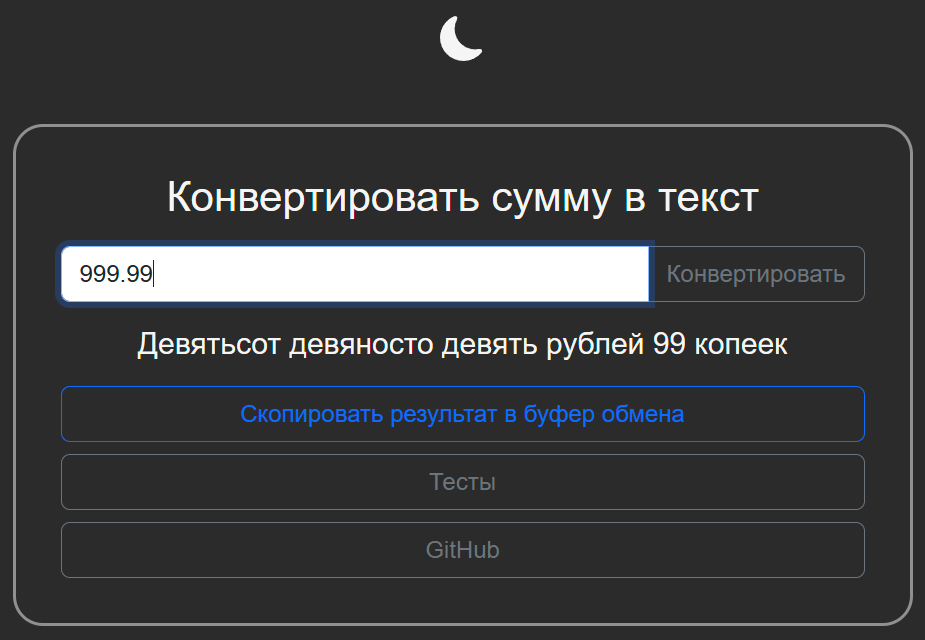
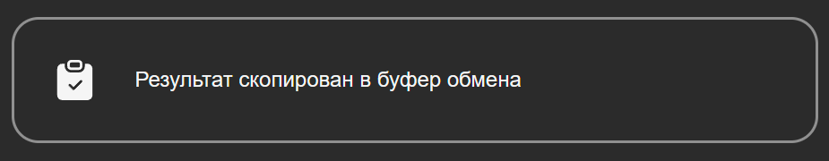
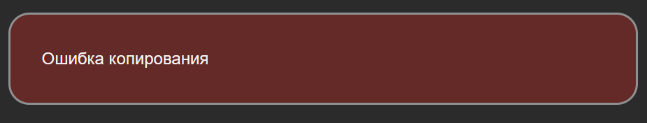

<h3>Функция конвертации числа (суммы в рублях) в текст</h3>
<h3><a href="https://igoromashov.github.io/numToText/">Запустить</a></h3>

<h3>Дисклеймер:</h3>
  Функция написана для использования как скрипт в Google Sheets. 
  Веб-интерфейс написан для быстрого ознакомления. Также можно ознакомиться с тестами. 
  Веб-интерфейс оптимизировался для ПК 
  В целом проект закончен, возможно будут улучшения. 
  Планируется переписать функцию на английский язык и добавить возможность выбора валюты 
  
<h3>Возможности программы:</h3>
<ul>
  <li>Получать число или строку (под капотом строка приводится в валидный вид).</li>
  <li>Проверка данных на валидность.</li>
  <li>Предельное обрабатываемое число - 9 999 999 999 999.99 (9 триллионов...)</li>
  <li>Выдача результата в виде строки</li>
  <li>Смена темы (день/ночь)</li>
  <li>Копирование результата в буфер обмена одной кнопкой</li>
</ul>
  
<h3>Реализация в HTML (только веб-интерфейс для демонстрации и тестирования):</h3>
<ul>
  <li>Разметка HTML классическая (ничего особенного)</li>
  <li>В HTML импортированы bootstrap стили</li>
  <li>Используется jQuery</li>
  <li>Весь JS код интегрирован в HTML, т.к. numToText.js должен содержать только саму функцию numToText (мне так хочется)</li>
  <li>CSS также интегрированы в HTML, инлайн стили использовал совсем чуть-чуть</li>
  <li>Основные блоки спозиционированы через absolute (мне так хотелось)</li>
  <li>Может быть выглядит немного неуважительно к HTML 😅, но ядро проекта - функция numToText</li>
</ul>

<h3>Реализация в JavaScript:</h3>
<ul>
  <li>Изначально валидируются входные данные (проверка на размер, величину, тип, приведение).</li>
  <li>Написаны карты имён в виде объектов.</li>
  <li>Написаны субфункции в виде функциональных выражений.</li>
  <li>Далее цикл и много условного ветвления.</li>
  <li>Имена формируются из карт и вкладываются в массив.</li>
  <li>Массив склеивается в строку и первая буква назначается заглавной.</li>
  <li>В целом всё описано комментариями.</li>
  <li>Цели по высокой оптимизации кода не было, написано "как есть".</li>
</ul>
  
  <h3>Скриншоты:</h3>
<ul>
  <li>Ночная тема (по умолчанию)</li>
</ul>
    

ОСТОРОЖНО! ГЛАЗА! Дневная тема

[![Дневная тема][1]][1]

[1]: ./screenshots/02.png

<ul>
  <li>Сообщение об успешном копировании</li>
</ul>
  
<ul>
  <li>Сообщение об ошибке (вероятность получения такой ошибки крайне мала)</li>
</ul>
  
  
<h3>Баги:</h3>
<ul>
  <li>Не обнаружены</li>
</ul>
